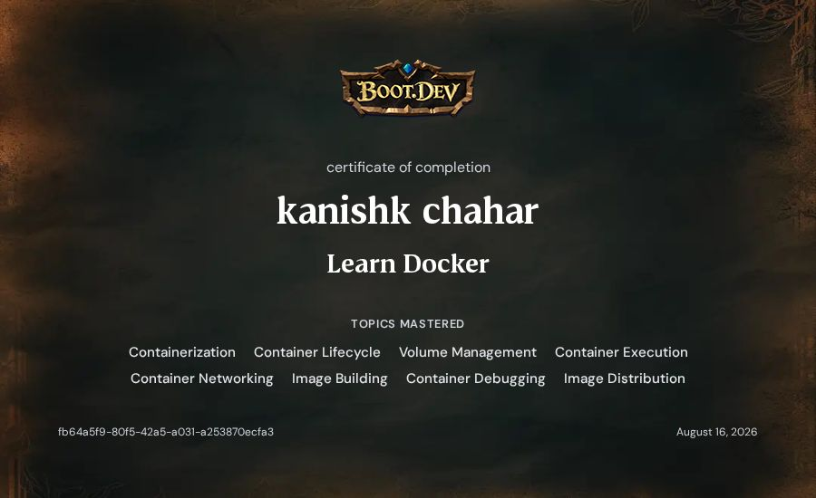
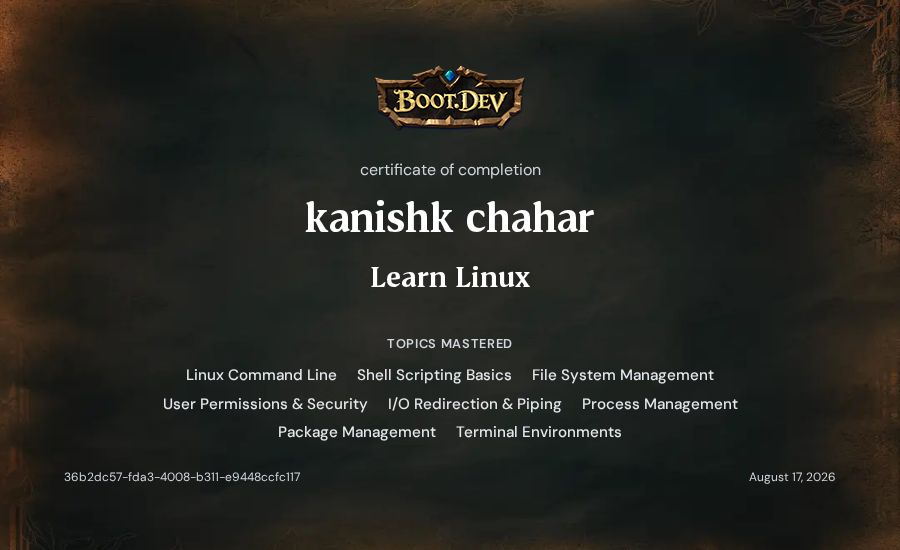
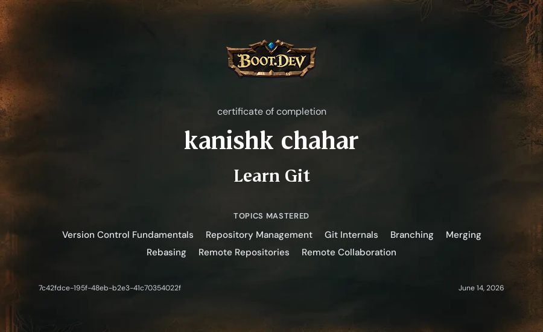

<h1 align="center">Kanishk Chahar</h1>
<h4 align="center">DevOps · Cloud Infrastructure · CI/CD · Linux Systems</h4>

  
  &nbsp;&nbsp;
  
  &nbsp;&nbsp;
  
  &nbsp;&nbsp;
  

---

<h3 align="center">About</h3>

  Engineering student focused on <strong>DevOps, Cloud Infrastructure, and System Automation</strong>. 
  I build reliable CI/CD pipelines, containerize services, and automate Linux infrastructure.

  Currently deepening skills in <strong>Kubernetes</strong>, <strong>AWS</strong>, and <strong>GitOps</strong> 
  Daily driving <strong>Fedora Linux</strong> — Bash scripting & system administration 
  Exploring <strong>Terraform</strong> and <strong>Ansible</strong> for infrastructure provisioning 
  Open to <strong>DevOps / Cloud / SRE</strong> roles and internships

---

<h3 align="center">Tech Stack</h3>

<table align="center">
  <tr>
    <td align="center" width="120">
      
       <strong>Docker</strong>
    </td>
    <td align="center" width="120">
      
       <strong>Kubernetes</strong>
    </td>
    <td align="center" width="120">
      
       <strong>AWS</strong>
    </td>
    <td align="center" width="120">
      
       <strong>Linux</strong>
    </td>
    <td align="center" width="120">
      
       <strong>Bash</strong>
    </td>
  </tr>
  <tr>
    <td align="center" width="120">
      
       <strong>Actions</strong>
    </td>
    <td align="center" width="120">
      
       <strong>Python</strong>
    </td>
    <td align="center" width="120">
      
       <strong>Git</strong>
    </td>
    <td align="center" width="120">
      
       <strong>GitHub</strong>
    </td>
    <td align="center" width="120">
      
       <strong>Nginx</strong>
    </td>
  </tr>
  <tr>
    <td align="center" width="120">
      
       <strong>Terraform</strong>
    </td>
    <td align="center" width="120">
      
       <strong>Ansible</strong>
    </td>
    <td align="center" width="120">
      
       <strong>Node.js</strong>
    </td>
    <td align="center" width="120">
      
       <strong>Prometheus</strong>
    </td>
    <td align="center" width="120">
      
       <strong>Grafana</strong>
    </td>
  </tr>
</table>

<strong>Detailed Breakdown</strong>

| Domain | Technologies |
| :---: | :---: |
| **Containers & Orchestration** | Docker · Docker Compose · Multi-stage Builds · Kubernetes |
| **CI/CD & Automation** | GitHub Actions · Automated Testing · Build Pipelines · Bash |
| **Cloud & IaC** | AWS (EC2, S3, IAM) · Terraform · Ansible |
| **Operating Systems** | Linux (Fedora, Debian, Ubuntu) · Systemd · Process Management |
| **Monitoring** | Prometheus · Grafana · Log Aggregation · Alerting |
| **Networking** | Wireshark · DNS (A, AAAA, MX, NS, TXT, SOA) · TCP/IP |
| **Version Control** | Git · GitHub · Branching Strategies · Code Review |

---

<h3 align="center">Projects</h3>

  &nbsp;
  

  &nbsp;
  

---

<h3 align="center">Certifications</h3>

  &nbsp;&nbsp;
  &nbsp;&nbsp;
  

<table align="center">
  <tr>
    <td align="center" width="33%">
      
       Boot.dev · Docker
    </td>
    <td align="center" width="33%">
      
       Boot.dev · Linux
    </td>
    <td align="center" width="33%">
      
       Boot.dev · Git
    </td>
  </tr>
</table>

---

<h3 align="center">GitHub Stats</h3>

  
  &nbsp;&nbsp;
  

---

  Open to collaboration — reach out via <a href="https://www.linkedin.com/in/kanishk-chahar34" target="_blank">LinkedIn</a> or <a href="mailto:kanishkchahar34@gmail.com">email</a>.

